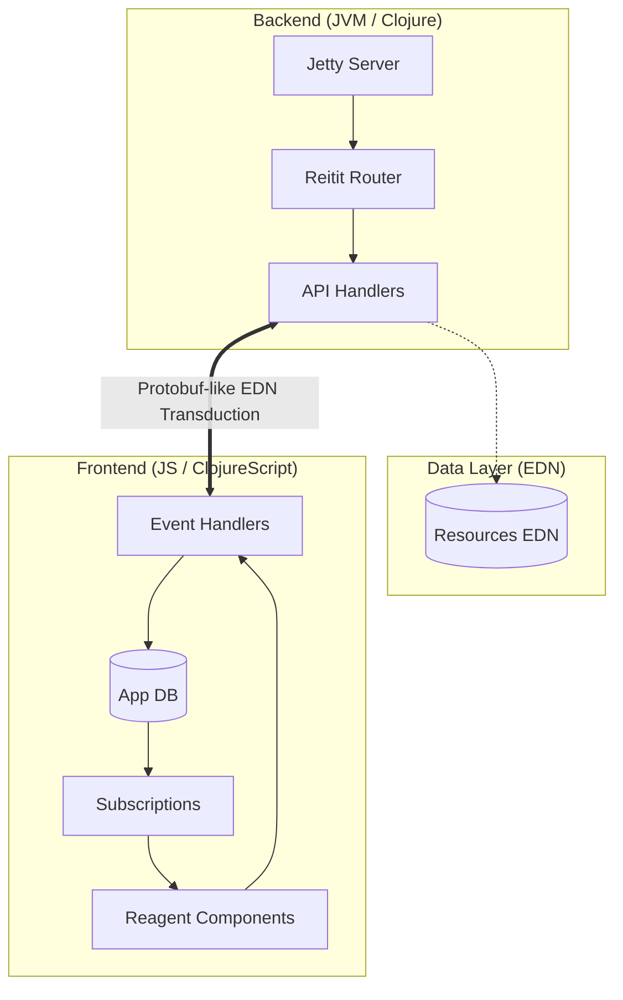

# Hodari Gardens Resort: Digital Excellence 🏝️✨

[](https://clojure.org/)
[](https://clojurescript.org/)
[](https://react.dev/)
[](https://day8.github.io/re-frame/)
[](https://tailwindcss.com/)
[](SECURITY.md)
[](https://hodari-gardens.fly.dev/)

A high-performance, reactive, and security-first digital platform for **Hodari Gardens Resort** in Nakuru, Kenya. 

**🎉 Live Deployment:** [https://hodari-gardens.fly.dev/](https://hodari-gardens.fly.dev/)

This is not just a website; it's a demonstration of the **unreasonable effectiveness** of Functional Programming (FP) in modern web engineering.

---

## ⚡ Why Clojure & ClojureScript?

This platform leverages the unique power of the Lisp philosophy to achieve a level of craftsmanship and agility that 10x engineers demand:

### 1. The Power of REPL-Driven Development
We don't wait for "builds." With **Shadow-CLJS** and a connected REPL, we modify the running application with sub-millisecond feedback. Logic changes, design tweaks, and state migrations happen live—without lost session state.

### 2. Immutability as a Superpower
By treating data as immutable and pushing side effects to the "edges" (via **re-frame** interceptors), we eliminate entire classes of bugs related to shared mutable state. The result is a rock-solid UI that behaves predictably under heavy interaction.

### 3. Data-Oriented Design
Everything is data. Routes, configuration, UI components, and state are all expressed as plain Clojure maps and vectors (EDN). This makes the system profoundly introspectable and easy to refactor.

---

## 🏛 Architectural Excellence

The system follows a pure functional, unidirectional data flow architecture.



---

## 🛡 Security Architecture

Security is not a feature; it's an invariant.

*   **Stateless Execution**: The backend maintains no session state, reducing the attack surface for session hijacking.
*   **Malli-Strict Validation**: Every API request and response is validated against formal schemas (**Malli**), ensuring zero unexpected data reaches the core logic.
*   **CSRF & XSS Hardening**: Leveraging Ring’s secure-site defaults and Reagent’s inherent protection against XSS by treating strings as text by default.
*   **Atomic State Transitions**: Application state updates are atomic, preventing "torn" state or race conditions.

---

## 🚀 Technical Highlights

*   **React 18 Concurrent Rendering**: Optimized for fluid UI response even during heavy data transduction.
*   **HSL Design Tokens**: A custom design system built with **Tailwind CSS**, optimized for both high-contrast luxury and low-light dark mode.
*   **Zero-Dependency Persistence**: Rapid, high-performance data access using optimized EDN resource loading.

---

## 🛠 Developer Workflow (10x Standard)

### Prerequisites
- JDK 17+
- Clojure CLI
- Node.js 20+

### Setup & Development
```bash
# Install dependencies
npm install

# Start development ecosystem
npm run dev     # Shadows-CLJS (Frontend)
npm run server  # Jetty (Backend)
```

### Productivity Tools
```bash
npm run lint    # Run Clj-Kondo static analysis
npm run format  # Enforce idiomatic code style
npm run build   # Production asset compilation
```

---

## 👨‍💻 Primary Creator

Developed and Maintained with precision by **dennisgathu8**.

*   **GitHub**: [@dennisgathu8](https://github.com/dennisgathu8)
*   **Project Site**: [hodarigardens.co.ke](https://hodarigardens.co.ke)

---
Copyright © 2026 dennisgathu8. Built with FP excellence.
