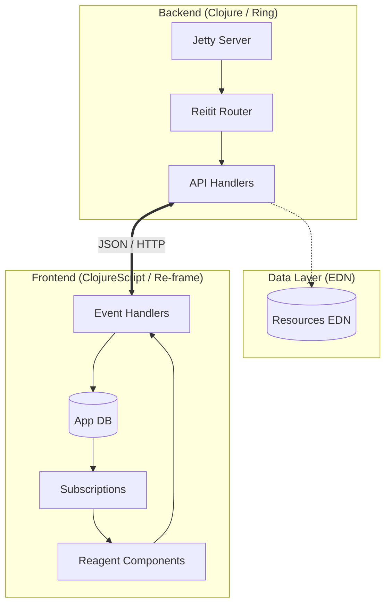

# Hodari Gardens Resort: Digital Experience

[](https://clojure.org/)
[](https://clojurescript.org/)
[](https://react.dev/)
[](https://day8.github.io/re-frame/)
[](https://tailwindcss.com/)
[](LICENSE)

A high-performance, reactive, and accessible digital platform for **Hodari Gardens Resort** in Nakuru, Kenya. Built with a modern Clojure/ClojureScript stack, this application leverages **React 18 Concurrent Rendering** and **re-frame** architectural patterns for an uncompromising user experience.

---

## 🏛 Architecture

The system follows a pure functional, data-driven architecture. The frontend utilizes a unidirectional data flow (re-frame), while the backend serves as a stateless API layer powered by immutable EDN data structures.



---

## 🚀 Technical Highlights

### 1. Modern UI Engine
- **React 18 Concurrent Mode**: Migrated to `reagent.dom.client/create-root` for improved rendering performance and future-proofing.
- **HSL-Based Design System**: Custom tailored color palettes ("Garden Green" & "Resort Gold") implemented via **Tailwind CSS**.
- **Dark Mode Native**: First-class support for system preferences and manual toggles with smooth transitions.

### 2. Full-Stack Performance
- **Unified Build Pipeline**: Automated Tailwind CSS compilation integrated with Shadow-CLJS advanced compilation.
- **SPA Fallback Routing**: Robust backend implementation ensuring 404-free page refreshes and direct URL navigation.
- **Zero-Dependency Data**: Core configuration stored in immutable EDN files for rapid iteration without database overhead.

### 3. Feature Set
- **Accommodation Engine**: Dynamic room exploration with multi-currency pricing display.
- **World Cup 2026 Hub**: Reactive countdown and match schedule filtering system.
- **Event Orchestration**: Rich media gallery with lazy-loading and lightbox integration.
- **Inquiry Pipeline**: Validated multi-step form data submission.

---

## 🛠 Tech Stack

| Layer | Technology | Purpose |
| :--- | :--- | :--- |
| **Backend** | Clojure (JVM) | Core business logic & API orchestration |
| **Web Server** | Ring + Jetty | High-concurrency HTTP stack |
| **Frontend** | ClojureScript / React 18 | Reactive UI & Concurrent Rendering |
| **State** | Re-frame | Global state management (interceptors, side-effects) |
| **Styling** | Tailwind CSS | Utility-first design system |
| **Routing** | Reitit / Bidi | Bidirectional, data-driven routing |
| **Build** | Shadow-CLJS / NPM | Hot-reloading & asset optimization |

---

## 📖 Developer Workflow

### Prerequisites
- JDK 11+
- Clojure CLI
- Node.js 18+ & NPM

### Environment Setup
```bash
# 1. Install dependencies
npm install

# 2. Spin up the ecosystem
# Terminal A (Backend)
npm run server

# Terminal B (Frontend + Hot Reload)
npm run dev
```

### Production Build
```bash
# Unified build compiles CSS and JavaScript
npm run build

# Generate Backend Uberjar
clj -T:build uber

# Execution
java -jar target/hodari-gardens-1.0.0.jar
```

---

## 📞 Support & Collaboration

For technical inquiries or system architectural discussions:
- **Project Site**: [hodarigardens.co.ke](https://hodarigardens.co.ke)
- **Email**: dev@hodarigardens.co.ke

---
Copyright © 2026 Hodari Gardens Resort. Built with FP excellence.
