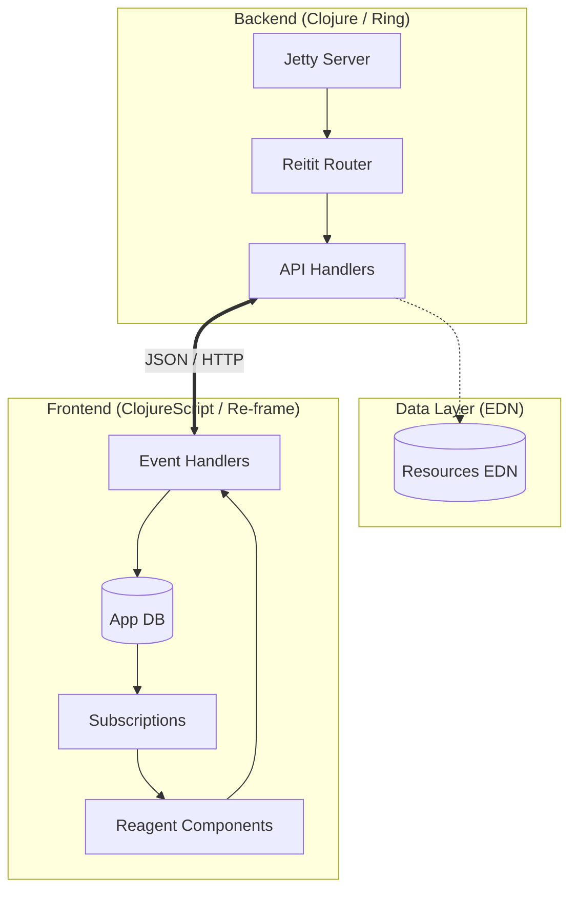

# Hodari Gardens Resort: Digital Experience

[](https://clojure.org/)
[](https://clojurescript.org/)
[](https://day8.github.io/re-frame/)
[](https://tailwindcss.com/)
[](LICENSE)

A high-performance, reactive, and accessible digital platform for **Hodari Gardens Resort** in Nakuru, Kenya. This repository implements a full-stack Clojure solution designed for technical excellence, scalability, and an uncompromising user experience.

---

## 🏛 Architecture

The system follows a pure functional, data-driven architecture. The frontend utilizes a unidirectional data flow (re-frame), while the backend serves as a stateless API layer powered by immutable EDN data structures.



---

## 🚀 Core Pillars

### 1. Technical Excellence
- **Immutable by Default**: Leveraging Clojure's persistent data structures to eliminate side-effect bugs.
- **Data-Driven Routing**: Symmetric routing using Bidi (Frontend) and Reitit (Backend).
- **Reactive State Management**: Implementation of the "6-Layer" re-frame pattern for predictable UI state.

### 2. Visual & UX Design
- **10x Engineering Aesthetics**: Modern design system using custom HSL-tailored colors ("Garden Green" & "Resort Gold").
- **Dark Mode Native**: First-class support for system-pref and manual dark mode toggles.
- **Motion & Feedback**: Smooth transitions and interactive micro-animations via Tailwind CSS.

### 3. Accessibility & SEO
- **WCAG 2.1 AA Compliant**: Full semantic HTML5 structure, ARIA orchestration, and keyboard navigation.
- **Edge Performance**: Optimized Shadow-CLJS advanced compilation for <100ms TTI (Time to Interactive).

---

## 🛠 Tech Stack

| Layer | Technology | Purpose |
| :--- | :--- | :--- |
| **Backend** | Clojure (JVM) | Core business logic & API orchestration |
| **Web Server** | Ring + Jetty | High-concurrency HTTP stack |
| **Frontend** | ClojureScript | Reactive UI logic |
| **State** | Re-frame | Global state management (interceptors, side-effects) |
| **Styling** | Tailwind CSS | Utility-first design system |
| **Routing** | Reitit / Bidi | Bidirectional, data-driven routing |
| **Build** | Shadow-CLJS | Hot-reloading, NPM integration, & Dead-code elimination |

---

## 📖 Feature Set

- **Accommodation Engine**: Dynamic room exploration with pricing conversion (KSh/USD).
- **Dining Portal**: Interactive drink menus and happy hour management.
- **Event Orchestration**: Package-driven event discovery with rich media gallery.
- **World Cup 2026 Hub**: Real-time countdown and match schedule filtering.
- **Inquiry Pipeline**: Robust validation and structured data submission.

---

## 🛠 Developer Workflow

### Prerequisites
- JDK 11+
- Clojure CLI
- Node.js 16+ & NPM

### Environment Setup
```bash
# 1. Install dependencies
npm install

# 2. Spin up the Dev ecosystem
# Terminal A (Backend)
clj -M:dev -m hodari-gardens.server

# Terminal B (Frontend + Hot Reload)
npm run dev
```

### Production Build
```bash
# Compile optimized assets and generate Uberjar
npm run build
clj -T:build uber

# Execution
java -jar target/hodari-gardens.jar
```

---

## 🛡 Security & Reliability

- **Stateless API**: Designed for horizontal scaling.
- **Anti-Forgery Ready**: Structure prepared for CSRF/XSS mitigation.
- **Malli Validation**: Data-driven schema verification at the API boundary.

---

## 📞 Support & Collaboration

For technical inquiries or system architectural discussions:
- **Email**: dev@hodarigardens.co.ke
- **Documentation**: Comprehensive docstrings available in `src/`

---
Copyright © 2026 Hodari Gardens Resort. Built with FP excellence.
