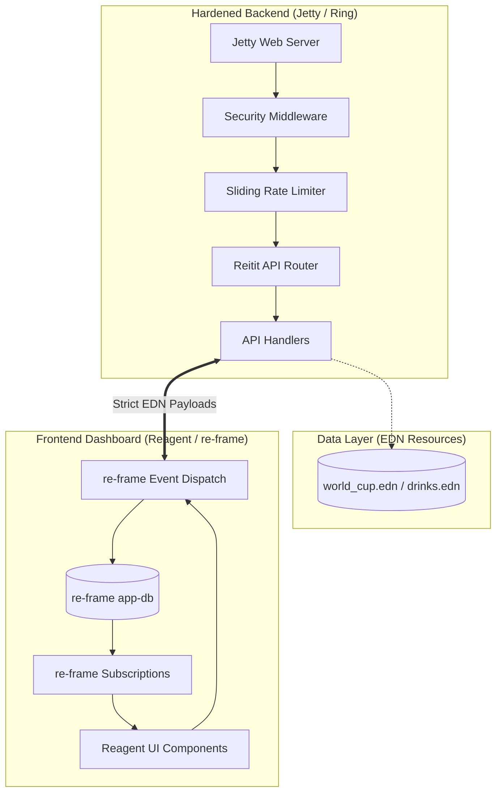

# Hodari Sports Gardens Resort: Production Platform 🏝️⚽✨

[](https://github.com/dennisgathu8/hodari-gardens/actions/workflows/ci.yml)
[](https://clojure.org/)
[](https://clojurescript.org/)
[](https://react.dev/)
[](https://day8.github.io/re-frame/)
[](https://tailwindcss.com/)
[](SECURITY.md)
[](https://hodarisportsgardens.com)

A high-performance, reactive, and security-hardened full-stack platform for **Hodari Sports Gardens Resort** in Nakuru, Kenya. Coordinated and engineered with strict functional programming principles.

**🌐 Secure Custom Domain:** [https://hodarisportsgardens.com](https://hodarisportsgardens.com)

---

## ⚡ Technical Vision & Stack

This platform leverages the **unreasonable effectiveness of Functional Programming** to build a modern, zero-maintenance guest experience platform.

*   **Core Language:** Clojure & ClojureScript for unified client-server language semantics.
*   **State Architecture:** Single-source-of-truth app-db powered by **re-frame** (unidirectional data flow).
*   **Routing System:** Dual-routing system using `reitit` on both backend (Ring API endpoints) and frontend (HTML5 push state).
*   **Build Chain:** **Shadow-CLJS** compiling production assets with Advanced Compilation, coupled with Tailwind CSS JIT compilation.
*   **Database Philosophy:** Zero-dependency, ultra-fast, read-optimized EDN (Extensible Data Notation) structures containing resort data, menus, and tournament fixtures.

---

## 🏛 Systems & Security Architecture

The application is structured as a pure, decoupled functional loop. 


```mermaid
graph TD
    subgraph "Data Layer (EDN Resources)"
        D[(world_cup.edn / drinks.edn)]
    end

    subgraph "Hardened Backend (Jetty / Ring)"
        S[Jetty Web Server]
        MW[Security Middleware]
        RL[Sliding Rate Limiter]
        R[Reitit API Router]
        A[API Handlers]
        
        S --> MW
        MW --> RL
        RL --> R
        R --> A
        A -.-> D
    end

    subgraph "Frontend Dashboard (Reagent / re-frame)"
        V[Reagent UI Components]
        SUB[re-frame Subscriptions]
        E[re-frame Event Dispatch]
        DB[(re-frame app-db)]
        
        V --> E
        E --> DB
        DB --> SUB
        SUB --> V
    end

    A <== "Strict EDN Payloads" ==> E
```

### 🛡 Core Security Specifications
*   **Custom CSP Rules:** Strict Content Security Policy allowing local assets, Google Fonts, and securely restricting embeds exclusively to verified Google Maps frames (`frame-src 'self' https://www.google.com`).
*   **Brute-Force & DDoS Mitigation:** Built-in backend rate limiters executing a sliding-window algorithm for guest inquiries and booking endpoints.
*   **HSTS & Modern TLS:** Enforced HTTP Strict Transport Security (`max-age=31536000; includeSubDomains; preload`) to guarantee secure communication.
*   **Zero-State JVM Execution:** Fully stateless API layer allowing seamless vertical and horizontal scaling.

---

## 🚀 Production Optimization

*   **Garbage Collection Tuning:** Custom JRE 17 Alpine image running inside the Fly container, utilizing highly tuned **G1GC** parameters (`-XX:+UseG1GC`) to ensure sub-millisecond pauses.
*   **Memory Safeguards:** JVM heap configured with `-Xms128m` and `-Xmx700m` limits to run safely within Fly's strict container quotas, protecting the app from Out Of Memory (OOM) termination.
*   **Aggressive Caching:** Production static assets (`/js/` and `/css/`) are injected with immutable headers (`Cache-Control: public, max-age=31536000, immutable`), ensuring instantaneous page loads for return visitors.

---

## 🛠 Production Operations & Development

### Local Setup
Ensure you have `JDK 17`, `Clojure CLI`, and `Node.js 20+` installed on your system.

```bash
# 1. Install required packages
npm install

# 2. Compile CSS assets
npm run css

# 3. Start local development watch (shadow-cljs)
npm run dev

# 4. Start the Ring/Jetty backend server
npm run server
```

### Production Release Compilation
To compile the minified release bundle and build the optimized production output:
```bash
npm run build
```

---

## 👨‍💻 Primary Creator

Developed and maintained with pristine engineering by **dennisgathu8**.

*   **GitHub:** [@dennisgathu8](https://github.com/dennisgathu8)
*   **Domain:** [https://hodarisportsgardens.com](https://hodarisportsgardens.com)

---
Copyright © 2026 dennisgathu8. Engineered for functional excellence.
